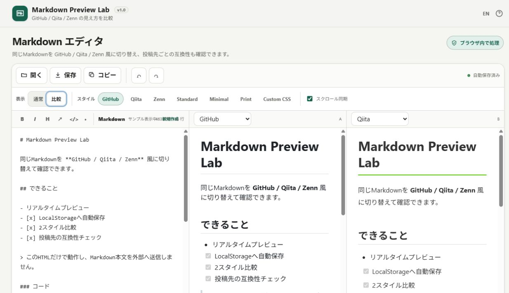

# Markdown Preview Lab

[](https://github.com/ttomohisa/htmlapps-markdown-preview-lab/actions/workflows/deploy-pages.yml)
[](LICENSE)
[](https://ttomohisa.github.io/htmlapps-markdown-preview-lab/)

[English README](README.md)

Markdownを外部へ送信せず、GitHub / Qiita / Zenn 風の見え方を比較しながら編集し、投稿先ごとの互換性も確認できる単一HTMLエディタです。

## 🚀 デモ

### [GitHub PagesでMarkdown Preview Labを開く](https://ttomohisa.github.io/htmlapps-markdown-preview-lab/)

GitHub Pagesから最初のHTMLを読み込んだ後、Markdownの編集・プレビュー・互換性チェック・自動保存・ファイル読み込み・保存はブラウザー内で処理されます。入力したMarkdownがアプリからサーバーへ送信されることはありません。



## 主な機能

- 左にMarkdown、右にリアルタイムプレビュー
- GitHub / Qiita / Zenn 風のプレビュースタイル
- Standard / Minimal / Print スタイル
- Custom CSSプレビュー
- 2種類のスタイルを同時に表示する比較モード
- **編集欄 + Preview A + Preview B の3ペイン連動スクロール**
- GitHub / Qiita / Zenn ごとの簡易互換度スコア
- 投稿先によって挙動が変わりやすい記法を警告
- 互換性警告をクリックして該当Markdown行へ移動
- LocalStorageへの自動保存と下書き自動復元
- 初回サンプルと、未編集時だけ表示される **「新規作成」** 導線
- 長文編集用の大きな編集ダイアログ
- 太字・斜体・見出し・リンク・コード・リストの入力補助
- 元に戻す・やり直す
- ファイル選択またはドラッグ&ドロップでMarkdown / テキストを読み込み
- 出力ファイル名を指定して `.md` 保存
- `.md` 拡張子を自動補完
- Markdownをクリップボードへコピー
- 1つのHTML内で日本語・英語を切り替え
- スマートフォン専用の「編集 / プレビュー / 比較」切替
- SVG faviconをHTML内に埋め込み
- CDNなし・外部ランタイムライブラリなし

## すぐに使う

### Webで使う

[デモを開く](https://ttomohisa.github.io/htmlapps-markdown-preview-lab/)だけで利用できます。インストールやアカウント登録は不要です。

### HTMLをダウンロードして使う

1. リポジトリの [`index.html`](https://github.com/ttomohisa/htmlapps-markdown-preview-lab/blob/main/index.html) をダウンロードします。
2. 最新のChromiumベースのブラウザー、Firefox、Safariなどで開きます。
3. そのままMarkdownを書き始めます。下書きはブラウザーのLocalStorageへ自動保存されます。

実行時にPython、Node.js、ローカルWebサーバー、外部CDNは不要です。

### リポジトリからビルドして使う（advance）

1. このリポジトリをダウンロードまたはクローンします。
2. Windowsで `build-standalone.bat` をダブルクリックするか、PowerShellから `build-standalone.ps1` を実行します。
3. 完全内包版が `dist/index.html` に生成されます。
4. 自己解凍形式の配布版は `dist/index.self-extract.html` に生成されます。
5. 生成されたHTMLを好きな場所へコピーして、ブラウザーで直接開けます。

このアプリには外部ランタイム依存がないため、ビルド時にサードパーティーライブラリを取得する必要もありません。

## 使い方

1. 左側の編集欄にMarkdownを書きます。
2. GitHub、Qiita、Zennなどのプレビュースタイルを選びます。
3. **表示 → 比較** に切り替えると、2種類のプレビューを同時表示できます。
4. **スクロール同期** を有効にしておくと、編集欄と2つの比較プレビューが連動します。
5. 下部の互換度スコアと警告を確認します。
6. 出力ファイル名を入力し、**保存** を押してMarkdownファイルをダウンロードします。

### 最初のサンプルについて

初回起動時は、主なMarkdown記法や比較機能をすぐ試せるようにサンプルが表示されます。

- サンプルをまだ編集していない状態では **「新規作成」** を押すと空の編集欄から始められます。
- サンプルをそのまま編集し始めると、「サンプル表示中」の案内は自動的に消えます。
- すでにLocalStorageへ保存された下書きがある場合は、サンプルではなく前回の内容を復元します。

### 比較モード

同じMarkdownが投稿先によってどのように見えるかを確認するためのモードです。

- Preview AとPreview Bで別々のスタイルを選択できます。
- 編集欄、Preview A、Preview Bの**どこをスクロールしても、残り2つが文書内の進捗率に合わせて追従**します。
- 個別に確認したい場合は **スクロール同期** をオフにできます。

### 互換性チェック

GitHub、Qiita、Zennで扱いが異なりやすいMarkdown記法を簡易解析します。プラットフォーム固有ブロック、数式、HTML、タスクリストなど、投稿前に確認したい箇所を見つけるための補助機能です。

表示されるパーセンテージは独自ルールによる目安です。公式の互換度ではなく、各サービスで完全に同じ表示になることを保証するものでもありません。

### 入力欄を大きくする

Markdown欄の見出しにある拡大アイコンを押すと、長文を編集しやすい大きな編集ダイアログが開きます。入力内容は元の編集欄へリアルタイムに同期され、閉じたあともカーソル位置を引き継ぎます。

### キーボード操作

| ショートカット | 操作 |
| --- | --- |
| `Tab` | Markdown編集欄へスペース2個を挿入 |
| `Ctrl` / `⌘` + `S` | 現在の出力ファイル名でMarkdownを保存 |
| `Esc` | ブラウザー標準のdialog操作で開いているダイアログを閉じる |

## v1.0で対応する主なMarkdown

組み込みレンダラーでは、よく使うMarkdownを中心に以下へ対応しています。

- 見出し
- 段落・改行
- 太字・斜体
- リンク
- インラインコード・コードブロック
- 番号付き・番号なしリスト
- 引用
- 水平線
- テーブル
- タスクリスト
- 画像
- 互換性チェック用の一部拡張記法

外部URLの画像は、通信防止のため実画像を読み込まずプレースホルダーとして表示します。

## GitHub / Qiita / Zenn風プレビューについて

GitHub、Qiita、Zennモードは、それぞれのサービスの公式レンダラーを内包したものではなく、**見た目と代表的な記法を比較するための近似プレビュー**です。

1つのブラウザー画面でタイポグラフィ・余白・一般的なMarkdownの表示・移植時の注意点を確認することを目的としています。表示の完全一致が必要な場合は、公開前に実際の投稿先でも最終確認してください。

## GitHub Pagesで公開する

このリポジトリには、単一HTMLをビルド・検証して `dist/` をGitHub Pagesへ公開するワークフローが含まれています。

1. リポジトリ名を `htmlapps-markdown-preview-lab` としてGitHubへプッシュします。
2. **Settings → Pages → Build and deployment → Source** で **GitHub Actions** を選択します。
3. `main` ブランチへプッシュするか、Actions画面からPages用ワークフローを手動実行します。
4. ビルド成功後、`https://ttomohisa.github.io/htmlapps-markdown-preview-lab/` で公開されます。

GitHub Pagesがまだ有効になっていない場合、同梱ワークフローはビルド自体を失敗扱いにせず、Workflow Summaryへ初回設定手順を表示します。

## 開発とビルド

```text
.
├─ src/index.template.html       # アプリ本体のソーステンプレート
├─ index.html                    # そのまま開ける単一HTML版
├─ app.config.json               # アプリ情報・ビルド設定
├─ dependencies.json             # ランタイム依存一覧（現在は空）
├─ build-standalone.bat          # Windows用ビルド入口
├─ build-standalone.ps1          # 単一HTMLビルダー
├─ scripts/
│  ├─ check-repository.ps1       # リポジトリ・ビルド検証
│  ├─ build-self-extract.ps1     # 自己解凍形式の生成
│  ├─ verify-standalone.ps1      # 単一HTML検証
│  └─ verify-self-extract.ps1    # 自己解凍版検証
├─ dist/
│  ├─ index.html                 # GitHub Pages公開用の生成物
│  └─ index.self-extract.html    # 自己解凍形式の生成物
└─ .github/workflows/
   ├─ build-standalone.yml       # ビルド検証
   └─ deploy-pages.yml           # GitHub Pages公開
```

`src/index.template.html` を編集した後は、以下で検証・再ビルドできます。

```powershell
./scripts/check-repository.ps1
```

リポジトリチェックでは、テンプレートで必須としているファイル構成を確認し、単一HTMLを再生成したうえで検証処理を実行します。

## プライバシーと通信防止

単一HTML版は、Markdownの内容を端末内に留めることを前提にしています。

- Content Security Policyに `connect-src 'none'` を設定
- CDNや外部ランタイムJavaScriptライブラリを使用しない
- 下書きは現在のブラウザーのLocalStorageへ保存
- Markdown内の外部画像URLへアクセスせず、プレビューではプレースホルダー表示
- GitHub Pages版では最初のHTML配信は発生しますが、入力したMarkdown本文をアプリがアップロードすることはありません

完全にネットワークを切って利用する場合は、`index.html` または生成済みの `dist/index.html` をローカルで開いてください。

## LocalStorageについて

自動保存はブラウザー内だけで行われます。以下には注意してください。

- サイトデータやブラウザーデータを削除すると、自動保存された下書きも消える場合があります。
- LocalStorageは重要な文書のバックアップ代わりにはなりません。
- 残したいMarkdownは定期的に **保存** して `.md` ファイルとして保管してください。
- ローカルHTML版とGitHub Pages版は保存元のOriginが異なるため、LocalStorageの下書きも別管理になる場合があります。

## 制限事項

- GitHub / Qiita / Zenn風プレビューは近似であり、公式レンダラーと表示が異なる場合があります。
- 互換度スコアは簡易判定のため、誤検出や未検出が発生する可能性があります。
- すべてのサービス固有Markdown拡張を再現することは目的としていません。
- 外部通信を禁止しているため、Markdown内のリモート画像は読み込みません。
- 非常に大きなMarkdownでは、端末性能によってリアルタイムプレビューが重くなる場合があります。
- LocalStorageの容量や保持条件はブラウザーや利用モードによって異なります。

## 使用ライブラリ

現在、**外部ランタイムライブラリへの依存はありません**。

| ライブラリ | バージョン | ライセンス | 用途 |
| --- | ---: | --- | --- |
| なし | — | — | Markdown解析・プレビュー・比較・互換性チェック・UIを単一HTML内で実装 |

リポジトリ内の通知事項は [THIRD_PARTY_NOTICES.md](THIRD_PARTY_NOTICES.md) を確認してください。

## コントリビューション

バグ報告や機能提案はGitHub Issuesからお願いします。開発への参加方法は [CONTRIBUTING.md](CONTRIBUTING.md) を確認してください。

## ライセンス

Copyright © 2026 ttomohisa

このプロジェクトは [MIT License](LICENSE) で公開されています。
